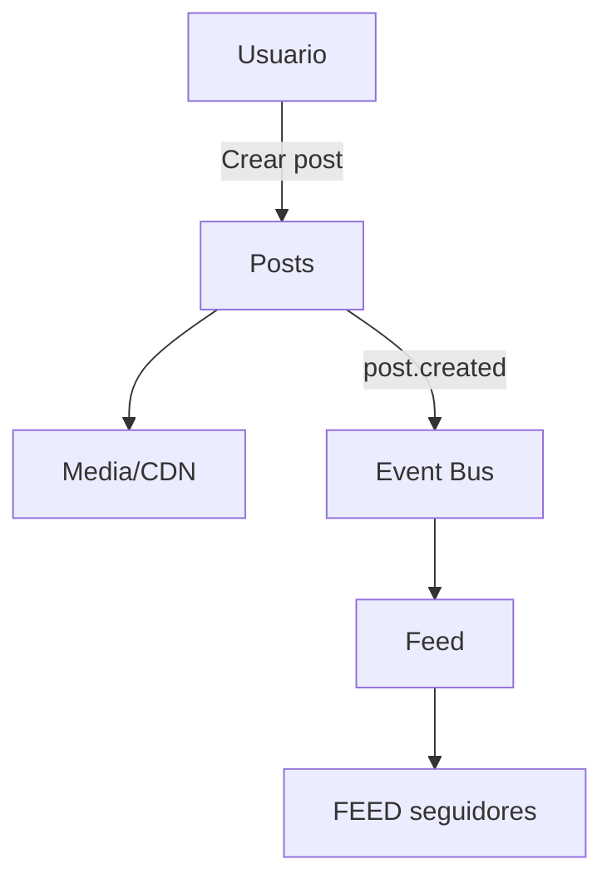
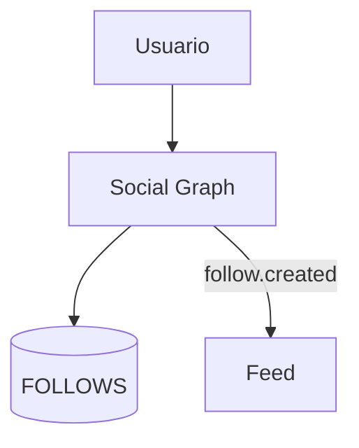
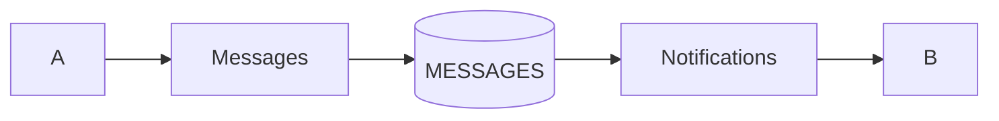
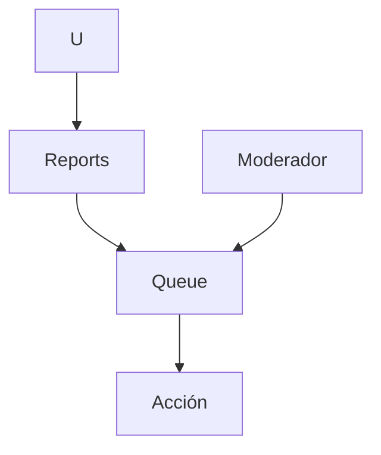

### Red Social · Especificación Funcional y Técnica

#### 1) Propósito y alcance
- Propósito: habilitar interacción social (publicar, seguir, comentar, chatear) para impulsar descubrimiento y retención.
- Alcance MVP: feed con posts (texto/imagen), likes, comentarios, seguir/dejar de seguir, perfiles, chat 1:1, notificaciones básicas, búsqueda simple.

#### 2) Actores
- Usuario: crea/consume contenido, sigue a otros, conversa por DM.
- Moderador: atiende reportes, aplica medidas.
- Admin: configura políticas, gestiona riesgos y auditoría.

#### 3) Casos de uso
- CU01 Publicar post: compositor → (opcional) imagen → publicar → feed.
- CU02 Interacción: like/unlike; comentar; ver detalle.
- CU03 Seguir: seguir/dejar de seguir; feed se personaliza.
- CU04 Perfil: info/estadísticas y posts; seguir desde perfil.
- CU05 Búsqueda: usuarios y hashtags.
- CU06 Mensajería: chat 1:1.
- CU07 Notificaciones: actividad relevante.
- CU08 Moderación: reportar y resolver.

#### 4) Requerimientos funcionales
- SNF01 Feed cronológico invertido (fan-out on write / fallback fan-in).
- SNF02 Posts: texto ≤ 2000, 1 imagen ≤ 5MB (JPG/PNG).
- SNF03 Likes/Comentarios: 1 like por usuario; comentarios anidados nivel 1.
- SNF04 Perfiles: avatar, bio, métricas; privacidad público/privado.
- SNF05 Social Graph: seguir/dejar de seguir; bloqueo.
- SNF06 Mensajería 1:1 con timestamps.
- SNF07 Búsqueda por usuario y #hashtag.
- SNF08 Notificaciones: likes, comentarios, follows, DM.
- SNF09 Moderación: reportes, acciones, auditoría.
- SNF10 Medios: subida/miniaturas; CDN.
- SNF11 Analytics básico por post.

#### 5) RNF
- Disponibilidad 99.9%; T50 < 2s; p95 < 4s.
- Escalable a 10k concurrentes; cache Redis; CDN.
- Seguridad: TLS, JWT, rate limits, anti-spam.
- Accesibilidad WCAG 2.1 AA; observabilidad completa.

#### 6) Arquitectura / Servicios
- users, social-graph, posts, feed, media, comments, likes, messages, moderation, notifications, search, analytics.
- Event bus para actividades (post.created, like.created, follow.created, comment.created, message.sent, content.reported).

#### 7) Modelo de datos (resumen)
- USERS(id, name, avatar_url, bio, is_private, created_at)
- FOLLOWS(follower_id, followee_id, created_at, UNIQUE(follower_id, followee_id))
- POSTS(id, author_id, text, media_url, media_meta, like_count, comment_count, created_at, status)
- COMMENTS(id, post_id, author_id, text, created_at)
- LIKES(user_id, post_id, created_at, UNIQUE(user_id, post_id))
- FEED(user_id, post_id, created_at)
- MESSAGES(id, conv_id, from_id, to_id, text, created_at, delivered_at)
- NOTIFICATIONS(id, user_id, kind, ref_id, read, created_at)
- REPORTS(id, reporter_id, target_type, target_id, reason, status, created_at)
- HASHTAGS(tag, usage_count); POST_HASHTAGS(post_id, tag)

#### 8) Flujos (mermaid)
Publicación:

Follow:

DM:

Moderación:

#### 9) Políticas internas
- Contenido, privacidad, seguridad, propiedad intelectual, moderación, transparencia, límites de tasa.

#### 10) API (fragmento)
- POST /posts; GET /feed; POST/DELETE /posts/:id/like; POST /posts/:id/comments
- POST/DELETE /users/:id/follow; GET /users/:id; GET /users/:id/posts
- GET /search?q=; GET/POST /messages/:userId; POST /reports
- GET/PATCH /notifications

#### 11) KPIs y Roadmap
- KPIs: DAU/retención, publicaciones, engagement, CTR follows, latencias.
- Roadmap: MVP → Búsqueda avanzada → Historias/analytics → Recomendaciones/anti-spam avanzado.

